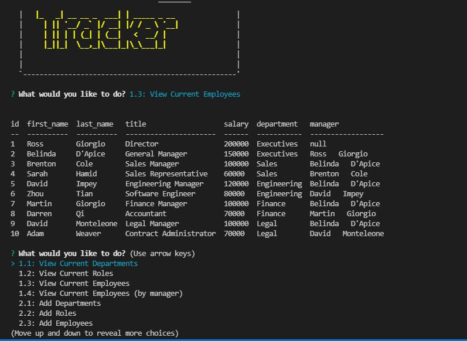
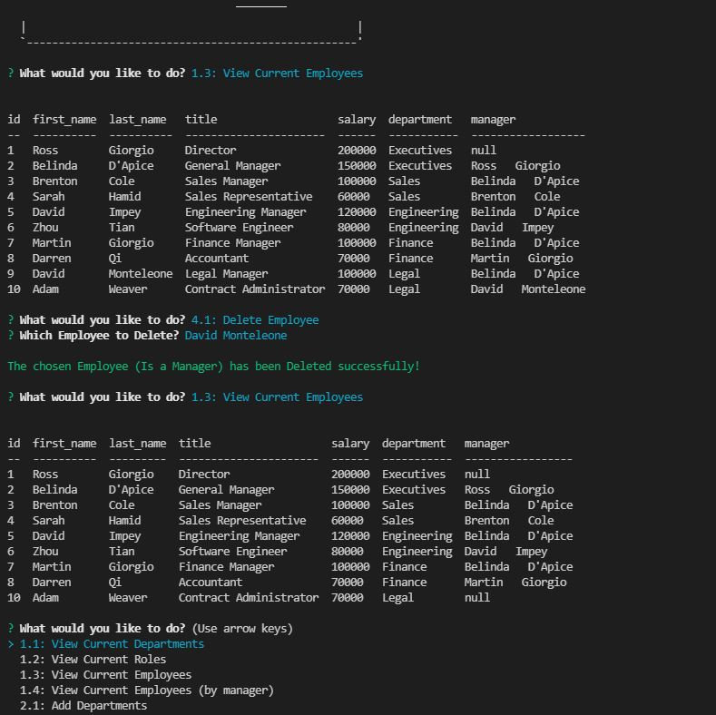

# zt_employee_tracker

## User Story

```md
AS a Company Manager
I WANT an Employee tracker
SO THAT I can quickly update and review the current team of my company.
```
## Starting Steps
* Open MYSQL , run employee.sql in db folder
* Remember " npm install " from terminal / cmd
* " npm start " from terminal / cmd to run this application

## Review

The following links for review:

* [A walkthrough video](https://drive.google.com/file/d/15yzdgt77Ph7mTtuxxsSAuus3n945F1E5/view) 
https://drive.google.com/file/d/15yzdgt77Ph7mTtuxxsSAuus3n945F1E5/view

* [The GitHub repository](https://github.com/ZhouTian0716/zt_employee_tracker)
https://github.com/ZhouTian0716/zt_employee_tracker

## Functionalities
* 1.1: View Current Departments
* 1.2: View Current Roles
* 1.3: View Current Employees
* 1.4: View Current Employees (by manager)
* 2.1: Add Departments
* 2.2: Add Roles
* 2.3: Add Employees
* 3.1: Update Employee role
* 3.2: Update Employee manager
* 4.1: Delete Employee

## MYSQL Knowledge in this application
* Relational Database tables.
* Foreign key constraint.
* Combining inqurier package with MYSQL queries.
* Manipulating multiple tables with MYSQL codes.

## Future Functionalities
* 4.2: Delete role
* 4.3: Delete department
* 5: View department budget

## Snap shots

Please see some of the functionalities and out puts from this app by checking the following snap shots.

1.View Current Employees.


2.Delete Employee

Note: In this example, which is "David Monteleone" and he is the manager of "Adam Weaver", Adam's manager becomes null before deleting "David Monteleone" because of the foreign key constraint. 



